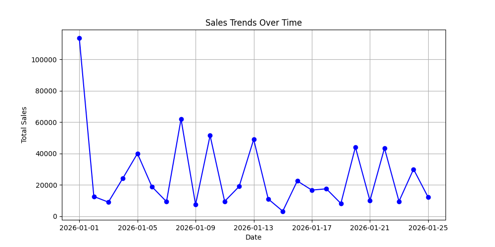
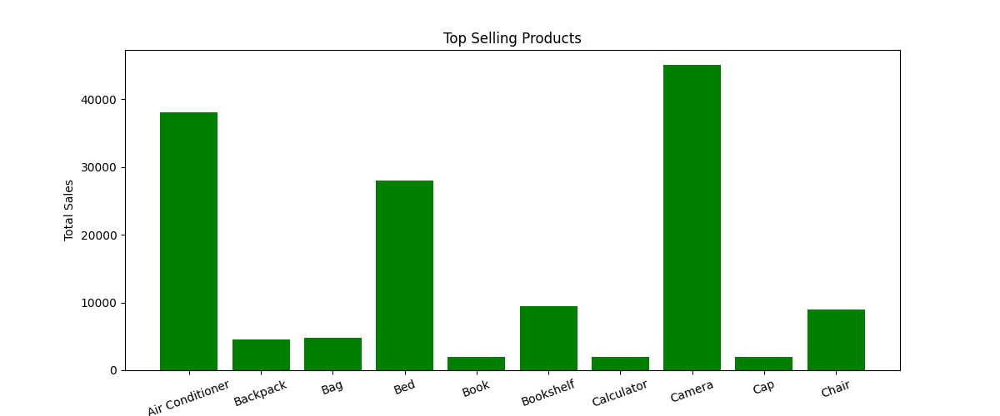
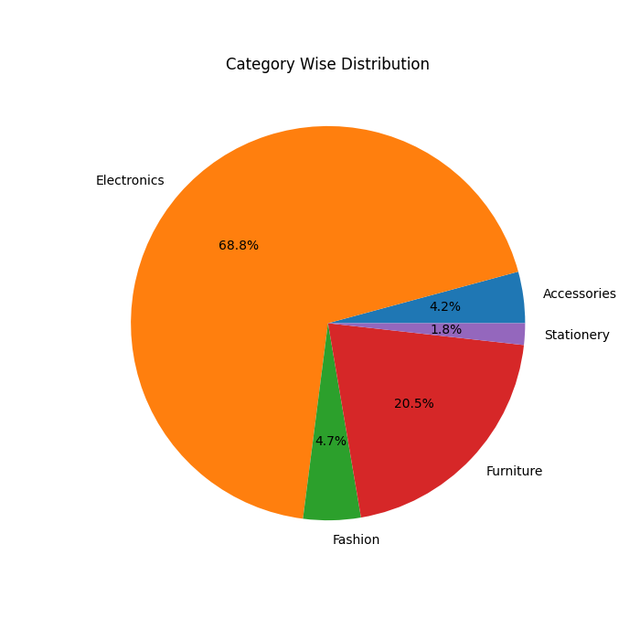

# Sales Dashboard Project

This is a simple Python project where I analyzed sales data and created charts to understand how sales are performing over time.

## About the Project

In this project, I used a sales dataset with products, categories, quantity, and price to find useful insights like:

 total sales
 best selling products
 category wise performance
 daily sales trends

The main goal of this project is to practice data analysis using Python.

## Tools Used

 Python  
 pandas  
 matplotlib  

## Dataset Information

The dataset contains sales records with the following columns:

 Date  
 Product  
 Category  
 Quantity  
 Price  

## Features

 Load and read CSV data  
 Calculate total sales  
 Find top selling products  
 Category wise analysis  
 Create bar chart and pie chart  
 Work with real-world style data  

## Output

 Sales trend over time  
 Top products chart  
 Category distribution chart  

## Graphs

### Sales Trends

### Top Products

### Category Distribution

